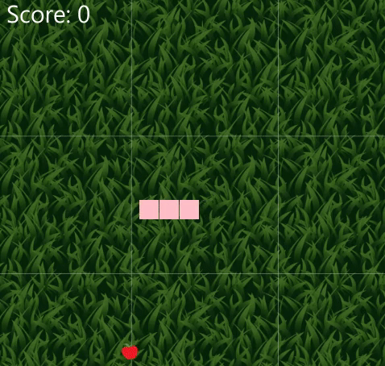

# IcySnake

Welcome to IcySnake! Immerse yourself in Snake game experience implemented in Java with JavaFX. Enjoy the nostalgic gameplay of snake game by eating food and growing in size or either try adding up a difficulty level for advanced experience.

## Features

- Classic Snake gameplay.
- Snake gameplay with a modern twist(power-up).
- Responsive and user-friendly controls.
- Score tracking to challenge yourself and others.
- Pause and resume functionality.
- Game contains sound functionality.
- Ability to customize UI.
- Options menu for additional features.

## Preview





## Getting Started

### Prerequisites

- Java Development Kit (JDK) installed
- JavaFX libraries

### Installation

1. Clone the repository:

    ```bash
    git clone https://github.com/Davids-Adamovics/IcySnakeProject
    ```

2. run the application using your favorite Java IDE.

## How to Play

- Press SPACE to start the game and pause/resume during gameplay.
- Avoid running into the snake's own body or the game borders.
- Collect fruits to grow the snake and increase your score.

## Controls

- **W or UP ARROW:** Move the snake upward.
- **A or LEFT ARROW:** Move the snake to the left.
- **S or DOWN ARROW:** Move the snake downward.
- **D or RIGHT ARROW:** Move the snake to the right.
- **R or P:** Restart the game.
- **SPACE:** Start the game, pause, or resume.

## Scoring

The score is based on the speed of the snake. Each time the snake consumes food, the speed increases, making the game more challenging.

## Options

The game includes an options menu where you can access additional features, including restarting the game and quitting.

## Contributing

If you would like to contribute to the development of this Snake Game, follow these steps:

1. Fork the repository.
2. Create a new branch: `git checkout -b feature/new-feature`.
3. Commit your changes: `git commit -m 'Add new feature'`.
4. Push to the branch: `git push origin feature/new-feature`.
5. Submit a pull request.

## License

This game is a school project and is not intended to claim ownership of the original game.